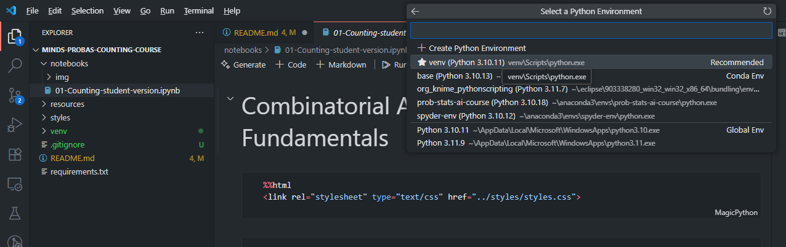

# MINDS-1-S1-EC-SP: Probabilities and Statistics. Course 01 - Counting Fundamentals

This is the first module of our Probability and Statistics course.

## Prerequisites

- Python 3.9 or higher
- Basic familiarity with Python programming
- Git

## Clone this Repositoty

```
git clone https://github.com/diana-nurbakova/minds-probas-counting-course.git
cd minds-probas-counting-course
```

## Set Up Your Environment

Create new virtual environment:
`python -m venv venv`

Activate it:

- on Windows:
`venv\Scripts\activate`

- on MacOS/Linux:
`source venv/bin/activate`

Install requirements.txt (it takes a bit of time):
`pip install -r requirements.txt`

## Repository Structure

```
├── notebooks/           # Jupyter notebooks with course content
│   ├── 01-Counting-student-version.ipynb  # Main learning material
│   └── img/            # Images used in notebooks
├── resources/          # Additional course resources
├── styles/            # CSS styling for notebooks
├── requirements.txt   # Python package dependencies
└── README.md          # This file
```

## Getting Started

1. Open `notebooks/01-Counting-student-version.ipynb`
2. In the top left corner, click on `Select kernel`. Choose `Python Environments...` Select your virtual environment `venv`.
